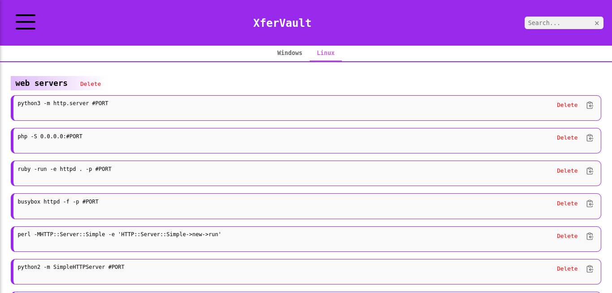
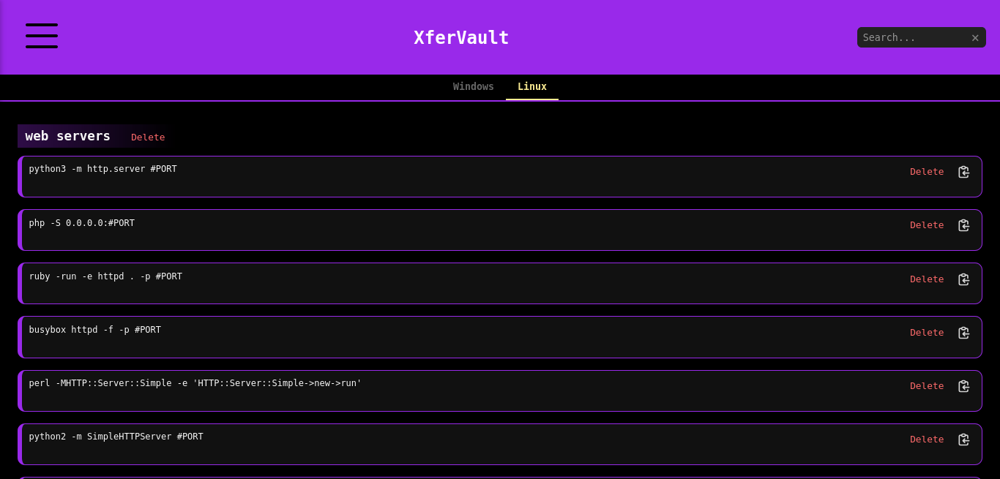
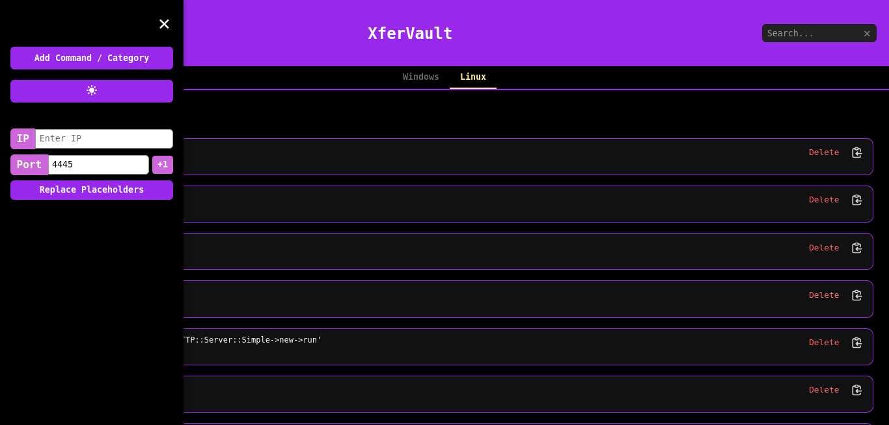
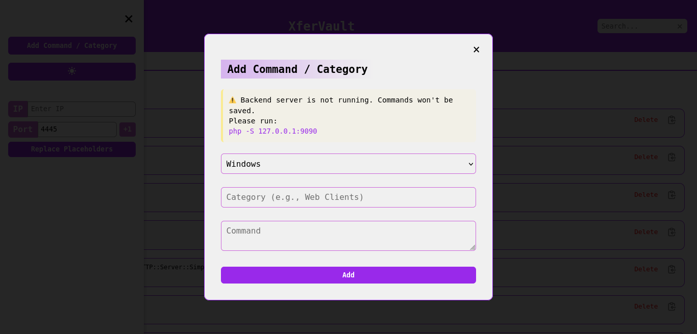
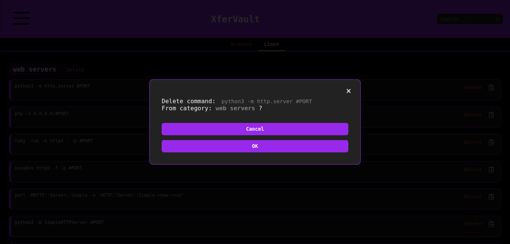
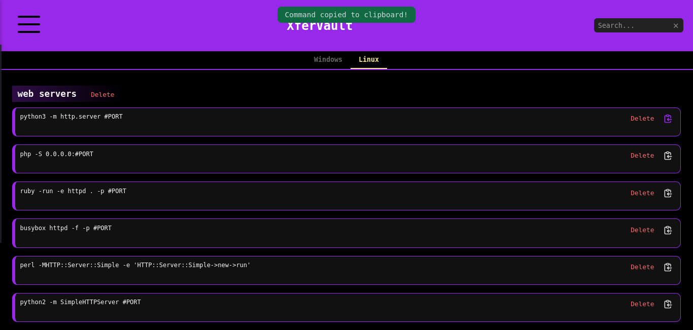
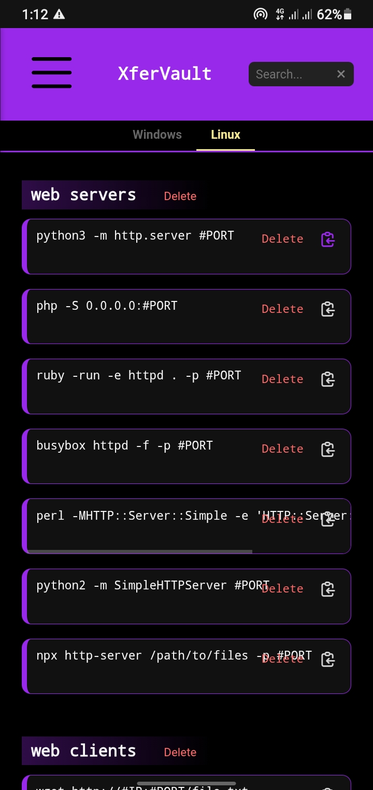

# XferVault    file-transfer-arsenal

XferVault is an offline reference that enables red teamers / penetration testers to quickly find, adapt, and use the right file transfer commands in any scenario.

Transferring files during red team engagements, pentests, or CTFs can be time-consuming and error-prone due to the many commands and protocols involved. **XferVault** provides an **offline, ready-to-use reference of validated file transfer commands** for Windows and Linux, covering SMB, FTP, SCP, rsync, socat, OpenSSL, and NFS. With **categorized commands, dynamic `#IP/#PORT` replacement, and a searchable interface**, XferVault helps users **quickly find, adapt, and deploy the right file transfer command** in any scenario.

use the xfervault webapp at [https://xfervault.github.com/](https://xfervault.github.io/XferVault/) 


## Features 

- **Modern GUI:** Clean, responsive interface with categories, modals, and sidebar navigation for an easy and professional experience.

- **Comprehensive Command Library** – Includes all common file transfer commands for Windows and Linux (SMB, FTP, SCP, rsync, socat, OpenSSL, NFS), ensuring coverage for any scenario.

- **Dynamic Placeholder Replacement** – Quickly replace `#IP` and `#PORT` in commands before use.

- **Optional Local Backend** – Used only for add/delete functionality and accessible only from localhost for security.

- **Command Management** – Add, delete, and categorize commands to fit your workflow.

- **Offline & Ready-to-Use** – Fully functional without an internet connection.

- **Search** – Easily search for commands or categories.

- **Copy to Clipboard** – One-click command copy for immediate deployment.

- **Persistent Storage** – Commands and categories securely stored locally in "data.js" file.

- **Organized by Categories** – Commands are grouped into categories (e.g., web servers) for easy browsing.


## Screenshots 
















## Installation & Usage

1. **Clone the repository**

```shell
git clone https://github.com/yourusername/XferVault.git
cd XferVault
```

2.  **Open the GUI**
   - Open `index.html` in your browser.
   - (Optional) **Bookmark the page** in your browser for quick access later.
   
3.  **Add/Delete Commands (Optional)**
   - Start the backend with:
```shell
php -S 127.0.0.1:9090
```
   - Use **Menu → Add Command/Category** to add new entries.
   - To delete a command or an entire category, click the **delete button** next to the desired item.


## Disclaimer 

i am **not responsible** for any misuse or damage caused by this tool.
